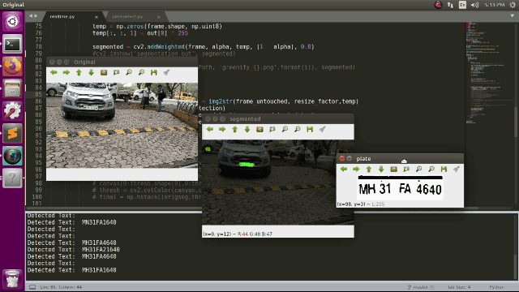
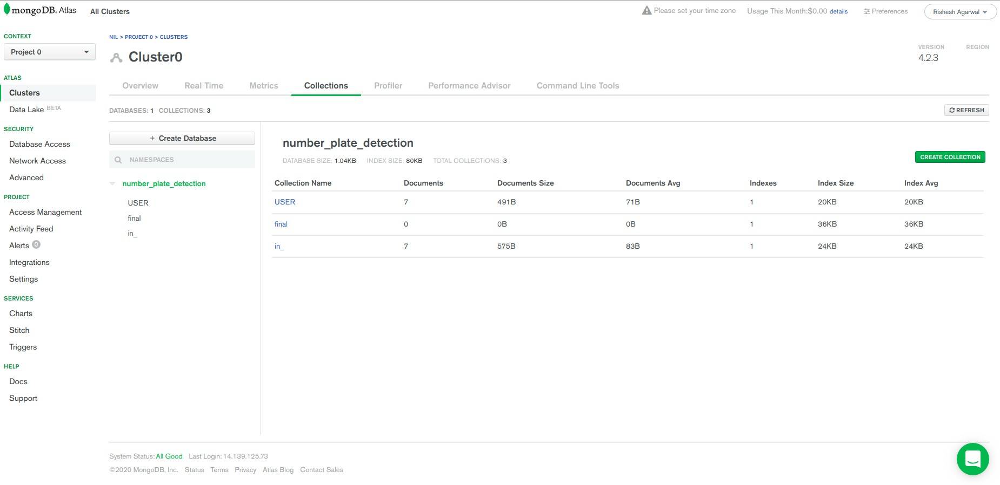
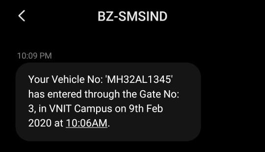
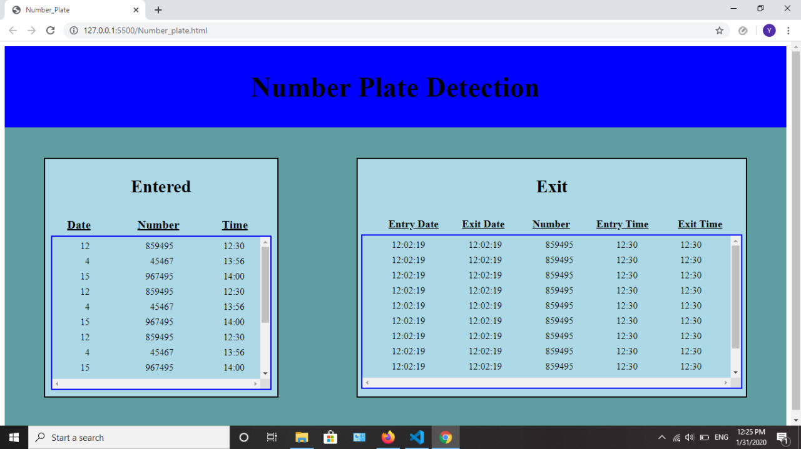
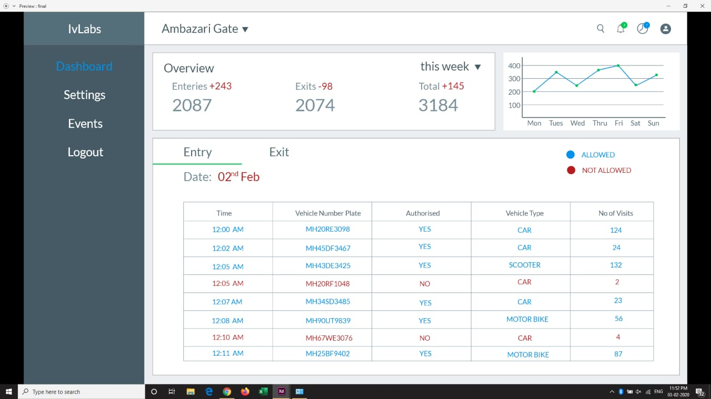
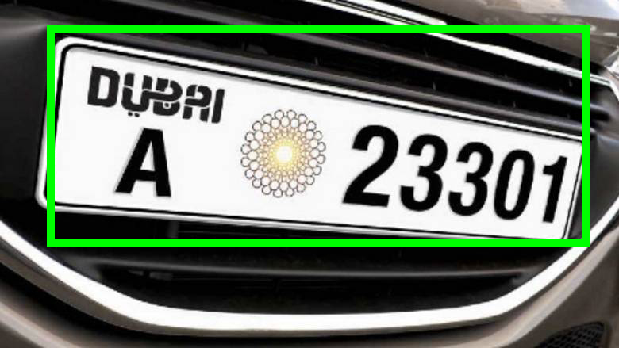
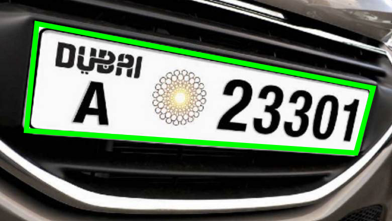
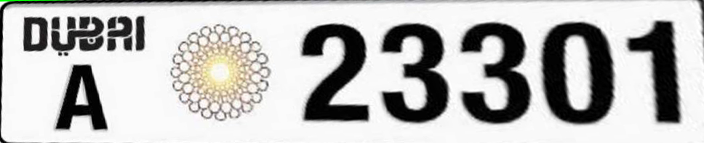

# Number Plate Detection

**For indpeth solutions, features, future works, revenue plan, etc please read the PDF attached. [Click Here](https://drive.google.com/file/d/1vmh-XKHFDTIsHa2YLfEPrvajIMPPD67C/view?usp=sharing)**

### Installation guide for Ubuntu OS
1. Clone this repository
2. Change your directory `cd sih_number_plate`
3. Make your virtual environment `virtualenv sih -p python3` (optional)
4. Activate the virtual environment `source sih/bin/activate` (optional)
5. Install tesseract engine `sudo apt-get install tesseract-ocr`
6. Install all dependencies `pip3 install -r requirements.txt` 
7. Make sure you have Nvidia Drivers installed for best performance

*NOTE: The current code is running slow is due to Pytesseract computation. It will be replced by custom Text detector in future commits. This is going to increase the speed of network by 200%*

### How to run
1. Download weights (YoloV3) from running `wget -P yolov3_detector/ https://pjreddie.com/media/files/yolov3.weights`
2. Run `python3 realtime.py`
3. Give file name as input. (See Line 21 of `realtime.py`) Eg. `Enter path to video: /home/rohit/Downloads/2.mp4`
4. The detected number plate will be displayed on the terminal along with 3 other windows which will show original frame, segmented frame and License plate
 
### Results
Completely loading this gif may take several minutes. Please wait while its fully loaded or Download results.gif from repo.

The code was executed on Ubuntu 18.04 with Nvidia 1660Ti GPU. The current FPS rate without Pytesseract is 43 FPS (average) and with Pytesseract its 12 FPS (average).

### Tasks
- [x] Number Plate extraction and perspective correction in realtime
- [x] OCR detection of number plate 
- [ ] Car type detection personal or commercial
- [ ] Car mask Extraction
- [ ] Web App UI
- [ ] Alert system
- [ ] Date and Time monitoring from multiple nodes
- [ ] Cloud Integration of Database
- [ ] Speed of vehicle
- [ ] IoT integration of multiple devices
- [x] Multiclass segmentation of car, bikes, scooter, trucks, autorickshaw, etc 
- [ ] Android App
- [ ] Face recognition if visible
- [ ] Car model prediction if possible
- [ ] Custom text detection and recognition
- [ ] Hindi and non-standard OCR detection
- [ ] Check Night mode 
- [ ] Regex corrector by taking most frequent characters
- [ ] Optimize by batch prediction
- [ ] Retrain with only capital letters
- [ ] Yolo exception handling (when no image)
- [ ] MNIST + EMNIST 
### Future works
If this work gets selected for future rounds of SIH'20 we have planned to add a series of features like

1. Since Pytesseract is very slow and doesnt work on real world texts, we have planned to train a custom CNN model like YoloV3 for text detection and recognition. We have already collected dataset of number plate and are in process to annotate numbers and letters for a custom text recogniser which will be way faster and accurate than Tesseract Engine. Other benifits include detection of irregular or not clearly visible text.
2. Face recognition using Dlib/Haar cascades.
3. Speed of vehicle using a camera perpendicular to motion of vehicle. The code is completed but it is yet to be tested for robustness under various circumstances.
4. Car model prediction. (Dataset collection and annotation in progress)

# Decentralised Database System And Web Application 

### Vehicle Number Plate Detection 

### How to run the app
1. Import the `final.py` file in your code  
2. For every entry of a vehicle call `entryGate` function with params: `NUMBER,ENTRY_DATE,ENTRY_TIME,PHONE_NO,MESSAGE`
3. For exit entry of a vehicle call `exitGate` function with params: `NUMBER,EXIT_DATE,EXIT_TIME,GATE_NO,MESSAGE`
3. To run the web-app call the function `real` from the `final.py` file
4. The detected number plate will be stored on the database with required ENTRY / EXIT conditions

### Built with
1. **[MongoDB](https://www.mongodb.com/)**
2. **[Flask](https://flask.palletsprojects.com/en/1.1.x/)**
3. **[sms4india](https://www.sms4india.com/)**
4. **[AdobeXD](https://www.adobe.com/in/products/xd/details.html)**

### Database Collection

### Alerting Message from Code

### Current WebApp

### Future work
1. Improving layout of web-app
2. Adding parking charges

### Final WebApp Design

## Project Details

### Solution Overview
- Our current solution (implemented) provides a robust registration plate detection, and extracts other features like car model, speed, face (if visible), date and time of entry/exit and upload the extracted data to a centralized IoT integrated database. Beneficiaries include malls, colleges, parking lots, etc. with multiple gates.

- Whenever the gate camera detects a departing car, the corresponding owner gets notified. Further, the owner can use the
alert feature to warn the guard. 

- The web application has two levels of access, the first providing general information about a specific car to the corresponding owner, and the latter one for the Authority, which stores all the data of a campus. This can be used to monitor the traffic on the campus and for surveillance applications.

### YoloV3 method vs our Semantic Segmentation method
This image shows a detection algorithm (Yolo) which draws a bounding box around the image. It performs very poorly in case of images which are not correctly oriented. 

We present a way to use semantic segmentation which will give exact corners of the number plate. This is a major requirement since the coordinates obtained can be later perspective corrected to give exact shape of letter. 

After applying 4 point transform and perspective correction the network has a very high probablity of recognizing correct digits. This results is better detection than any other algorithm

### Dataset Info
#### Dataset of consisting of an image scraped through google and segmented number plate 
Total: 2905 images, Sample dataset link: [Click Here](https://drive.google.com/drive/folders/1ZjCQ2Yro8kJLr0LjkA3Q0DlSUSN1y3_I?usp=sharing)

#### Dataset of various number plates with bounding box around numbers and letters. (For OCR purpose)
Total: 10000 images, Sample dataset link: *Yet to be annotated*

#### The Street View House Numbers (SVHN) Dataset
Total: 73257 images, Sample dataset link: [Click Here](http://ufldl.stanford.edu/housenumbers/)

#### EMNIST
Total: 100,000+ images of handwritten letters and digits. 

### Contributers
- Rohit Lal 
- Himanshu Patil
- Khush Agrawal
- Rishesh Agarwal
- Arihant Gaur
- Akshata Kinage

##### This repo will be updated soon to include indepth explainations of codes.
